# Deep Photo Enhancer: Unpaired Learning for Image Enhancement from Photographs with GANs

### [[Demo website]](http://www.cmlab.csie.ntu.edu.tw/project/Deep-Photo-Enhancer/) [[Youtube]](https://www.youtube.com/watch?v=d7OXb2sqoec) [[Paper]](https://www.cmlab.csie.ntu.edu.tw/project/Deep-Photo-Enhancer/CVPR-2018-DPE.pdf) [[Supplementary]](https://www.cmlab.csie.ntu.edu.tw/project/Deep-Photo-Enhancer/CVPR-2018-DPE-sm-compress.pdf) [[Download Demo Video]](https://www.cmlab.csie.ntu.edu.tw/project/Deep-Photo-Enhancer/enhance_video_crop.mp4)
### [[Spotlight Presentation-video]](https://www.youtube.com/watch?v=7y-zyzJXxxI) [[Spotlight Presentation-pdf]](https://www.cmlab.csie.ntu.edu.tw/project/Deep-Photo-Enhancer/CVPR-2018-DPE-spotlight-compress.pdf) [[Poster]](https://www.cmlab.csie.ntu.edu.tw/project/Deep-Photo-Enhancer/CVPR-2018-DPE-poster-compress.pdf)

<p align="center">
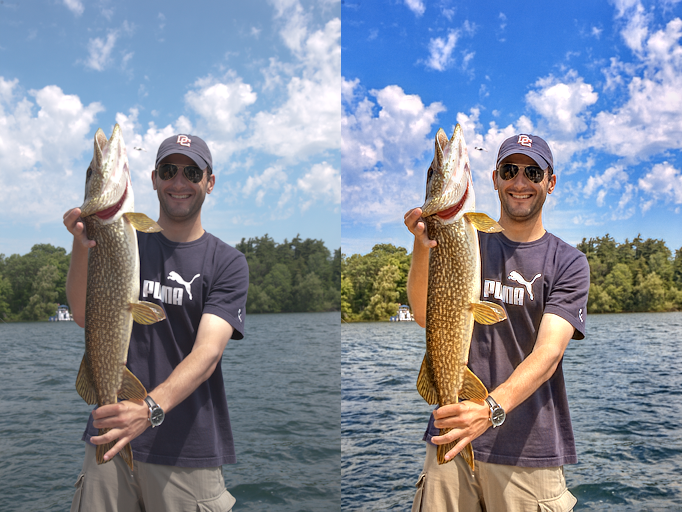
<a href="https://www.youtube.com/watch?v=d7OXb2sqoec" span>
   
</a>
<a href="https://www.cmlab.csie.ntu.edu.tw/project/Deep-Photo-Enhancer/CVPR-2018-DPE-poster-compress.pdf" span>
   
</a>
</p>
TensorFlow implementation of the CVPR 2018 spotlight paper, Deep Photo Enhancer: Unpaired Learning for Image Enhancement from Photographs with GANs. If you use any code or data from our work, please cite our paper.

### [Update Jun. 05, 2019] Rename Model script
I add the `rename_model.py` to the download link below.

### [Update Mar. 31, 2019] Inference Models (Supervsied and Unsupervised).
Download link: [here](https://www.cmlab.csie.ntu.edu.tw/project/Deep-Photo-Enhancer/[Online_Demo_Models]_Deep-Photo-Enhancer.zip). The code is exactly the same I used in my demo website. (Sorry, I do not have time to polish it...)
Simplified tutorial: Using the function `getInputPhoto` and `processImg` in the `TF.py`

### [Update Dec. 18, 2018] Data and Code (Supervsied and Unsupervised).
There are too many people asked me to release the code even the code is not polished and is ugly as me. Therefore, I put my ugly code and the data [here](https://www.cmlab.csie.ntu.edu.tw/project/Deep-Photo-Enhancer/[Experimental_Code_Data]_Deep-Photo-Enhancer.zip). I also provide the [supervised code](https://www.cmlab.csie.ntu.edu.tw/project/Deep-Photo-Enhancer/[Experimental_Supervised_Code]_Deep-Photo-Enhancer.zip). There are a lot of unnecessary parts in the code. I will refactor the code ASAP. Regarding the data, I put the name of the images we used on [MIT-Adobe FiveK dataset](https://data.csail.mit.edu/graphics/fivek/). I directly used Lightroom to decode the images to TIF format and used Lightroom to resize the long side of the images to 512 resolution (The label images are from retoucher C). I am not sure whether I have right to release the HDR dataset we collected from [Flickr](https://www.flickr.com/search/?text=HDR) so I put the ID of them. You can download the images according to the IDs. (The code was run on 0.12 version of TensorFlow. The A-WGAN part in the code did not implement decreasing the lambda since the initial lambda was relatively small in that case.)

Some useful issues: [#6](https://github.com/nothinglo/Deep-Photo-Enhancer/issues/6), [#16](https://github.com/nothinglo/Deep-Photo-Enhancer/issues/16), [#18](https://github.com/nothinglo/Deep-Photo-Enhancer/issues/18), [#24](https://github.com/nothinglo/Deep-Photo-Enhancer/issues/24), [#27](https://github.com/nothinglo/Deep-Photo-Enhancer/issues/27), [#38](https://github.com/nothinglo/Deep-Photo-Enhancer/issues/38), [#39](https://github.com/nothinglo/Deep-Photo-Enhancer/issues/39)

### Results

<p align="center"></p>
	
| Method | Description |
| :---: | --- |
| Label | Retouched by photographer from MIT-Adobe 5K dataset [1] |
| Our (HDR) | Our model trained on our HDR dataset with unpaired data |
| Our (SL) | Our model trained on MIT-Adobe 5K dataset with paired data (supervised learning) |
| Our (UL) | Our model trained on MIT-Adobe 5K dataset with unpaired data |
| CycleGAN (HDR) | CycleGAN's model [2] trained on our HDR dataset with unpaired data |
| DPED_device | DPED's model [3] trained on a specified device with paired data (supervised learning) |
| CLHE | Heuristic method from [4] |
| NPEA | Heuristic method from [5] |
| FLLF | Heuristic method from [6] |

<p></p>

<table>
  <tr>
    <th>Input</th>
    <th>Label</th>
    <th>Our (HDR)</th>
  </tr>
  <tr>
    <td></td>
    <td>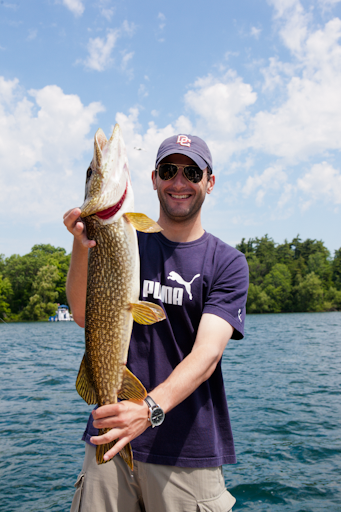</td>
    <td>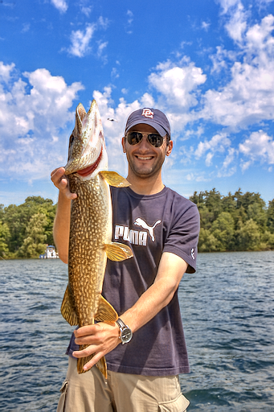</td> 
  </tr>
  <tr>
    <th>Our (SL)</th>
    <th>Our (UL)</th>
    <th>CycleGAN (HDR)</th>
  </tr>
  <tr>
    <td>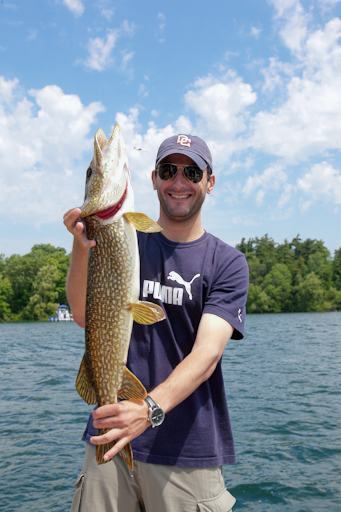</td>
    <td>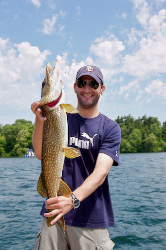</td>
    <td>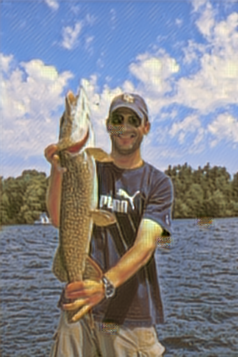</td>
  </tr>
  <tr>
    <th>DPED_iPhone6</th> 
    <th>DPED_iPhone7</th>
    <th>DPED_Nexus5x</th>
  </tr>
  <tr>
    <td></td> 
    <td>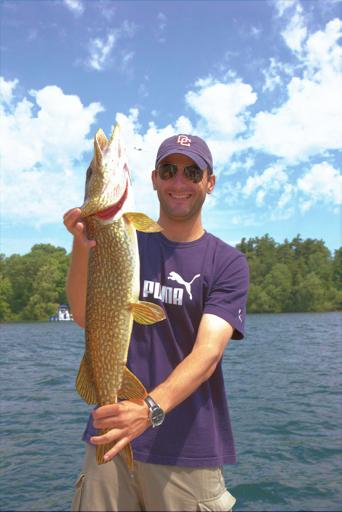</td>
    <td>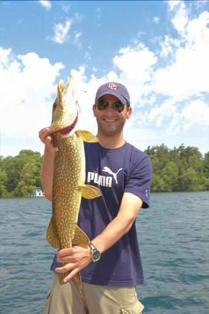</td>
  </tr>
  <tr>
    <th>CLHE</th> 
    <th>NPEA</th>
    <th>FLLF</th>
  </tr>
  <tr>
    <td>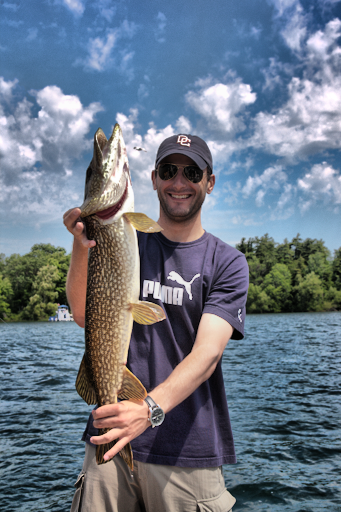</td> 
    <td>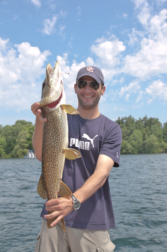</td>
    <td>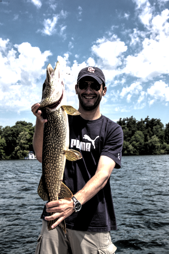</td>
  </tr>
</table>
<table>
  <tr>
    <th>Input (MIT-Adobe)</th>
    <th>Our (HDR)</th>
    <th>DPED_iPhone7</th>
    <th>CLHE</th>
  </tr>
  <tr>
    <td></td> 
    <td></td>
    <td></td>
    <td></td>
  </tr>
  <tr>
    <td></td> 
    <td></td>
    <td></td>
    <td></td>
  </tr>
  <tr>
    <td>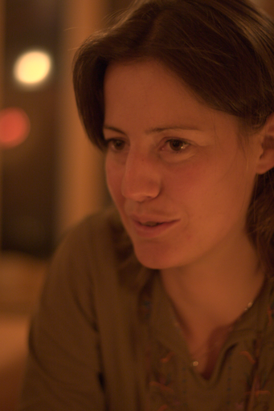</td> 
    <td>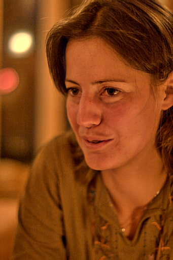</td>
    <td>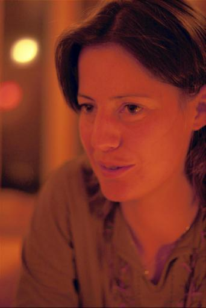</td>
    <td>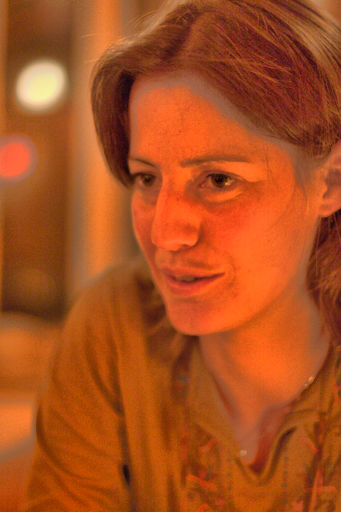</td>
  </tr>
  <tr>
    <td></td> 
    <td></td>
    <td></td>
    <td></td>
  </tr>
  <tr>
    <td></td> 
    <td></td>
    <td></td>
    <td></td>
  </tr>
  <tr>
    <td>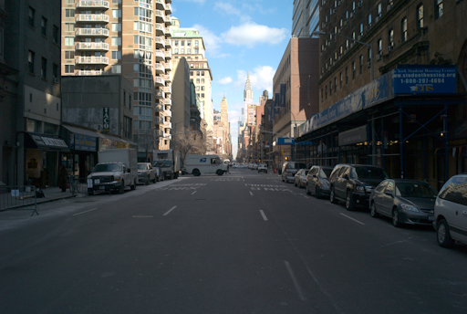</td> 
    <td>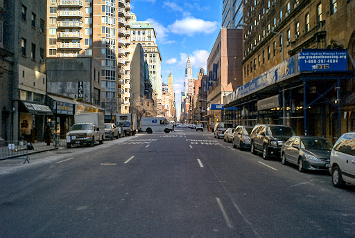</td>
    <td>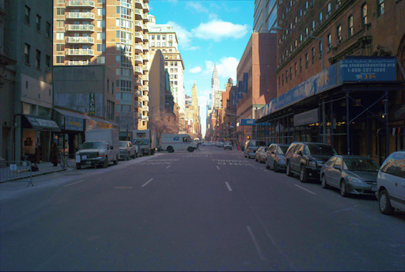</td>
    <td>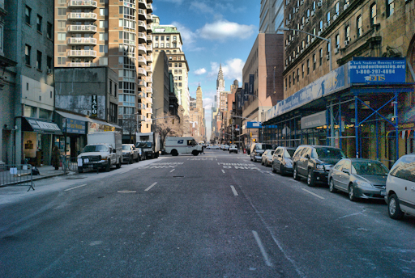</td>
  </tr>
    <td>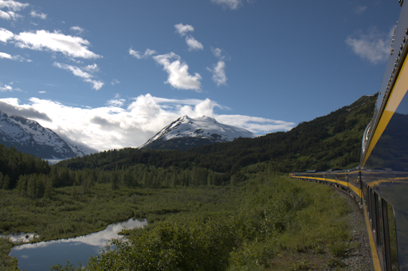</td> 
    <td></td>
    <td>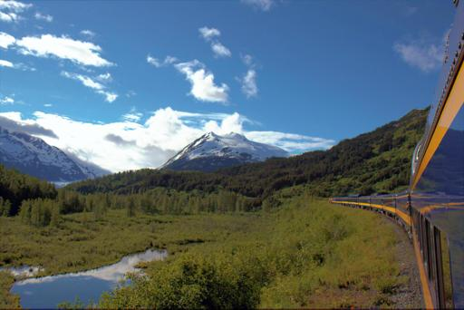</td>
    <td></td>
  </tr>
  </tr>
    <td>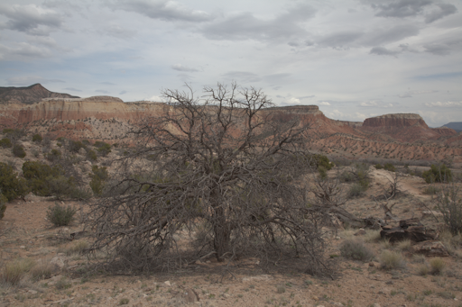</td> 
    <td>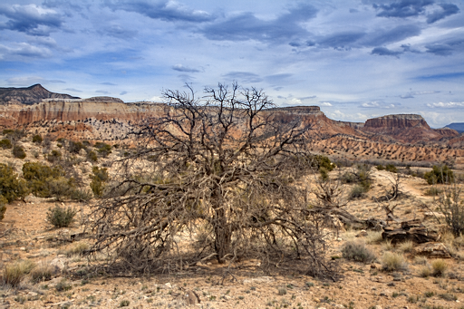</td>
    <td>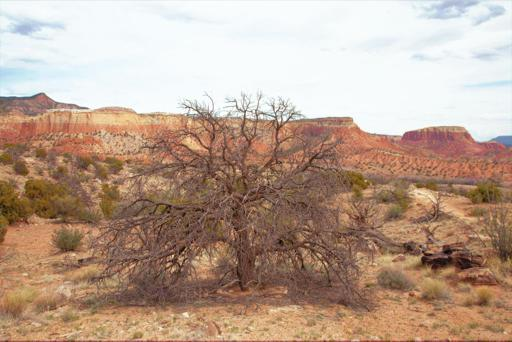</td>
    <td>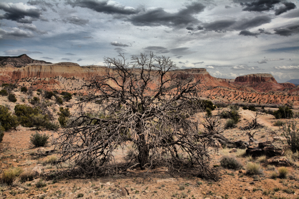</td>
  </tr>
    <tr>
    <th>Input (Internet)</th>
    <th>Our (HDR)</th>
    <th>DPED_iPhone7</th>
    <th>CLHE</th>
  </tr>
  <tr>
    <td>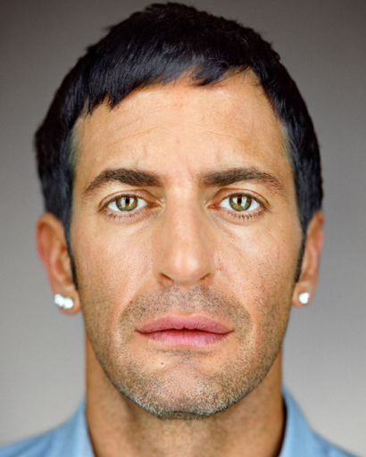</td> 
    <td>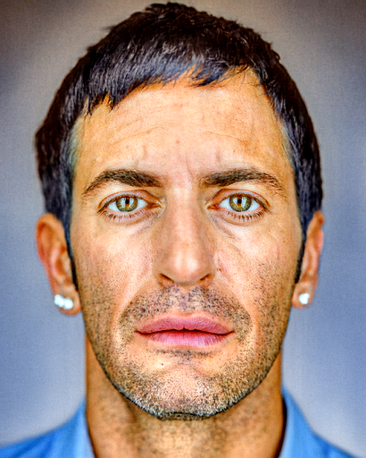</td>
    <td>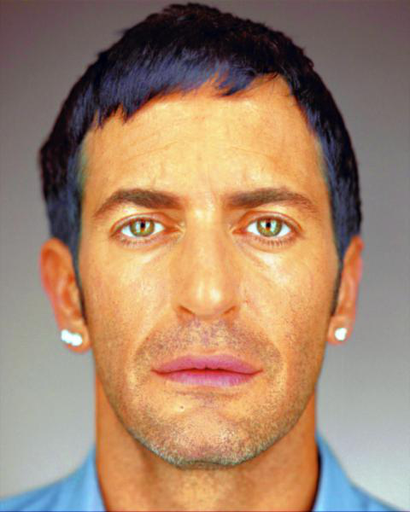</td>
    <td>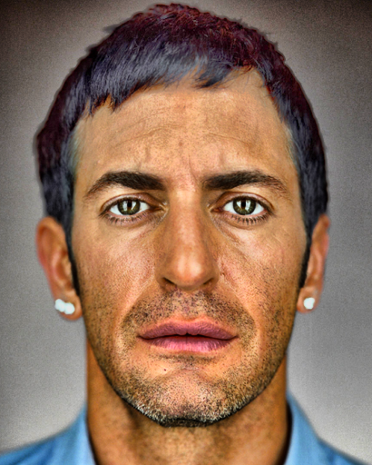</td>
  </tr>
  <tr>
    <td></td> 
    <td></td>
    <td></td>
    <td></td>
  </tr>
  <tr>
    <td></td> 
    <td></td>
    <td></td>
    <td></td>
  </tr>
  <tr>
    <td>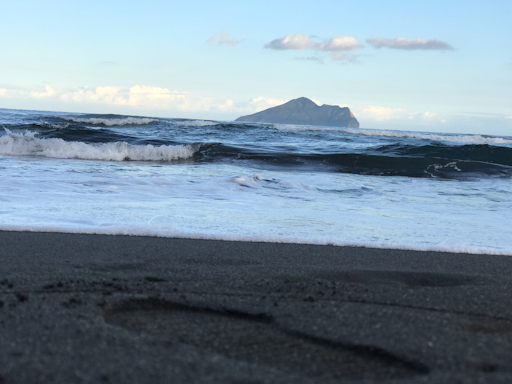</td> 
    <td></td>
    <td>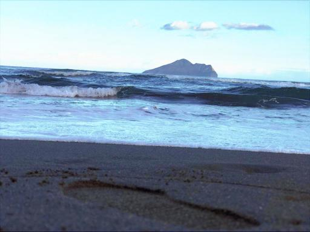</td>
    <td></td>
  </tr>
  <tr>
    <td>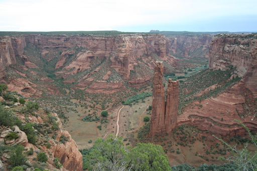</td> 
    <td></td>
    <td>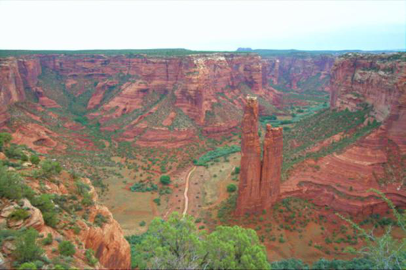</td>
    <td></td>
  </tr>
  <tr>
    <td></td> 
    <td></td>
    <td></td>
    <td></td>
  </tr>
  <tr>
    <td></td> 
    <td></td>
    <td></td>
    <td></td>
  </tr>
  <tr>
    <td></td> 
    <td></td>
    <td></td>
    <td></td>
  </tr>

  <tr>
    <td>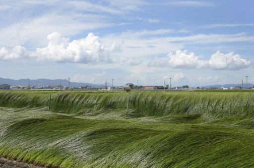</td> 
    <td></td>
    <td>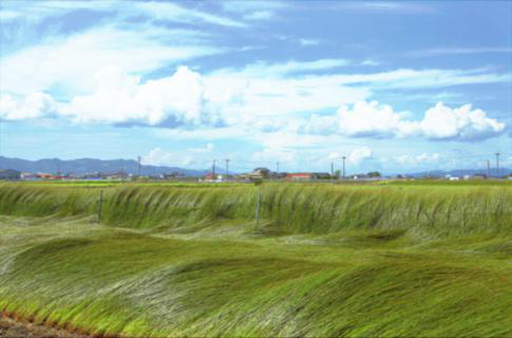</td>
    <td>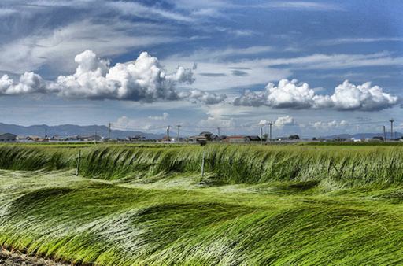</td>
  </tr>
  <tr>
    <td></td> 
    <td></td>
    <td></td>
    <td></td>
  </tr>
  <tr>
    <td></td> 
    <td></td>
    <td></td>
    <td></td>
  </tr>
  <tr>
    <td></td> 
    <td></td>
    <td></td>
    <td></td>
  </tr>
  <tr>
    <td></td> 
    <td></td>
    <td>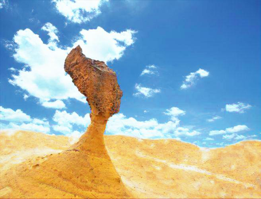</td>
    <td></td>
  </tr>
</table>

### User study

<table>
  <tr>
     <td colspan=7 align="center"> Preference Matrix<br>
(20 participants and 20 images using pairwise comparisons) </td>
  </tr>
  <tr>
     <th></th>
     <th>CycleGAN</th>
     <th>DPED</th>
     <th>NPEA</th>
     <th>CLHE</th>
     <th>Ours</th>
     <th>Total</th>
  </tr>
  <tr>
     <th>CycleGAN</th>
     <td align="center">-</td>
     <td align="center">32</td>
     <td align="center">27</td>
     <td align="center">23</td>
     <td align="center">11</td>
     <th>93</th>
  </tr>
  <tr>
     <th>DPED</th>
     <td align="center">368</td>
     <td align="center">-</td>
     <td align="center">141</td>
     <td align="center">119</td>
     <td align="center">29</td>
     <th>657</th>
  </tr>
  <tr>
     <th>NPEA</th>
     <td align="center">373</td>
     <td align="center">259</td>
     <td align="center">-</td>
     <td align="center">142</td>
     <td align="center">50</td>
     <th>824</th>
  </tr>
  <tr>
     <th>CLHE</th>
     <td align="center">377</td>
     <td align="center">281</td>
     <td align="center">258</td>
     <td align="center">-</td>
     <td align="center">77</td>
     <th>993</th>
  </tr>
  <tr>
     <th>Ours</th>
     <td align="center">389</td>
     <td align="center">371</td>
     <td align="center">350</td>
     <td align="center">323</td>
     <td align="center">-</th>
     <th>1433</th>
  </tr>
  <tr>
    <td colspan=7> Our model trained on HDR images ranked the first and CLHE was the runner-up. When comparing our model with CLHE, 81% of users (323 among 400) preferred our results. </td>
  </tr>
</table>

### Other applications of global U-Net, A-WGAN and iBN
This paper proposes three improvements: global U-Net, adaptive WGAN (A-WGAN) and individual batch normalization (iBN). They generally improve results; and for some applications, the improvement is sufficient for crossing the bar and leading to success. We have applied them to some other applications.

<table>
  <tr>
    <th>Input</th>
    <th>Ground truth</th>
    <th>global U-Net</th>
    <th>U-Net</th>
  </tr>
  <tr>
    <td></td> 
    <td>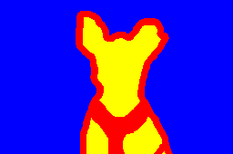</td>
    <td>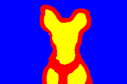</td>
    <td>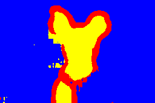</td>
  </tr>
  <tr>
    <td>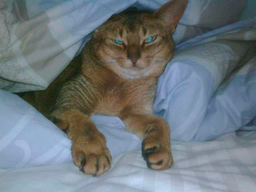</td> 
    <td>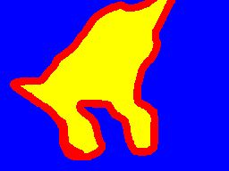</td>
    <td>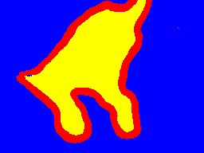</td>
    <td>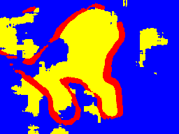</td>
  </tr>
  <tr>
    <td>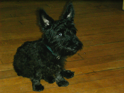</td> 
    <td>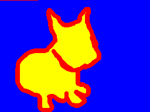</td>
    <td>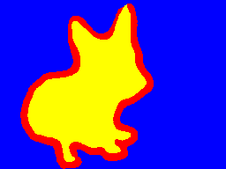</td>
    <td>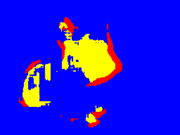</td>
  </tr>
  <tr>
    <td colspan=4>For global U-Net, we applied it to trimap segmentation for pets using the Oxford-IIIT Pet dataset. The accuracies of U-Net and global U-Net are 0.8759 and 0.8905 respectively.
</td>
  </tr>
</table>

<table>
  <tr>
    <th></th>
    <th>λ = 0.1</th>
    <th>λ = 10</th>
    <th>λ = 1000</th>
  </tr>
  <tr>
    <th>WGAN-GP</th>
    <th></th> 
    <th>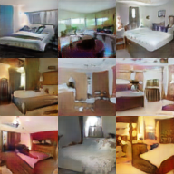</th>
    <th>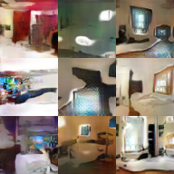</th>
  </tr>
  <tr>
    <th>A-WGAN</th>
    <th></th> 
    <th></th>
    <th></th>
  </tr>
  <tr>
    <td colspan=4>With different λ values, WGAN-GP could succeed or fail. The proposed A-WGAN is less dependent with λ and succeeded with all three λ values.</td>
  </tr>
</table>

<table>
  <tr>
    <th colspan=3>Male -> Female</th>
    <th colspan=3>Female -> Male</th>
  </tr>
  <tr>
    <th>Input</th>
    <th>with iBN</th>
    <th>w/o iBN</th>
    <th>Input</th>
    <th>with iBN</th>
    <th>w/o iBN</th>
  </tr>
  <tr>
    <th></th>
    <th></th>
    <th></th>
    <th></th>
    <th></th>
    <th></th>
  </tr>
  <tr>
    <th></th>
    <th></th>
    <th></th>
    <th></th>
    <th></th>
    <th></th>
  </tr>
  <tr>
    <th></th>
    <th></th>
    <th></th>
    <th></th>
    <th></th>
    <th></th>
  </tr>
  <tr>
    <th></th>
    <th></th>
    <th></th>
    <th></th>
    <th></th>
    <th></th>
  </tr>
  <tr>
    <td colspan=6>We applied the 2-way GAN to gender change of face images. As shown in the figure, the 2-way GAN failed on the task but succeeded after employing the proposed iBN.
</td>
  </tr>
</table>

### Architecture

<table>
  <tr>
    <th colspan=2>Generator</th>
  </tr>
  <tr>
    <th colspan=2></th>
  </tr>
  <tr>
    <th colspan=2>Discriminator</th>
  </tr>
  <tr>
    <th colspan=2></th>
  </tr>
  <tr>
    <th>1-way GAN</th>
    <th>2-way GAN</th>
  </tr>
  <tr>
    <th></th>
    <th></th>
  </tr>
</table>

### Publication
[Yu-Sheng Chen](https://www.cmlab.csie.ntu.edu.tw/~nothinglo/), [Yu-Ching Wang](https://www.cmlab.csie.ntu.edu.tw/~urchinwang/), [Man-Hsin Kao](https://www.cmlab.csie.ntu.edu.tw/~cindy0711/) and [Yung-Yu Chuang](https://www.csie.ntu.edu.tw/~cyy/).

[National Taiwan University](https://www.ntu.edu.tw)

Deep Photo Enhancer: Unpaired Learning for Image Enhancement from Photographs with GANs. Proceedings of IEEE International Conference on Computer Vision and Pattern Recognition 2018 (CVPR 2018), to appear, June 2018, Salt Lake City, USA.

### Citation
```
@INPROCEEDINGS{Chen:2018:DPE,
	AUTHOR    = {Yu-Sheng Chen and Yu-Ching Wang and Man-Hsin Kao and Yung-Yu Chuang},
	TITLE     = {Deep Photo Enhancer: Unpaired Learning for Image Enhancement from Photographs with GANs},
	YEAR      = {2018},
	MONTH     = {June},
	BOOKTITLE = {Proceedings of IEEE International Conference on Computer Vision and Pattern Recognition (CVPR 2018)},
	PAGES     = {6306--6314},
	LOCATION  = {Salt Lake City},
}
```
### Reference

> 1. *Bychkovsky, V., Paris, S., Chan, E., Durand, F.: Learning photographic global tonal adjustment with a database of input/output image pairs. In: Proceedings of the 2011 IEEE Conference on Computer Vision and Pattern Recognition. pp. 97-104. CVPR'11 (2011)*
> 2. *Zhu, J. Y., Park, T., Isola, P., Efros, A. A.: Unpaired image-to-image translation using cycle-consistent adversarial networks. In: Proceedings of the 2017 IEEE International Conference on Computer Vision. pp. 2242-2251. ICCV'17 (2017)*
> 3. *Ignatov, A., Kobyshev, N., Vanhoey, K., Timofte, R., Van Gool, L.: DSLR-quality photos on mobile devices with deep convolutional networks. In: Proceedings of the 2017 IEEE International Conference on Computer Vision. pp. 3277-3285. ICCV'17 (2017)*
> 4. *Wang, S., Cho, W., Jang, J., Abidi, M. A., Paik, J.: Contrast-dependent saturation adjustment for outdoor image enhancement. JOSA A. pp. 2532-2542. (2017)*
> 5. *Wang, S., Zheng, J., Hu, H. M., Li, B.: Naturalness preserved enhancement algorithm for non-uniform illumination images. IEEE Transactions on Image Processing. pp. 3538-3548. TIP'13 (2013)*
> 6. *Aubry, M., Paris, S., Hasinoff, S. W., Kautz, J., Durand, F.: Fast local laplacian filters: Theory and applications. ACM Transactions on Graphics. Article 167. TOG'14 (2014)*

### Contact
Feel free to contact me if there is any questions (Yu-Sheng Chen nothinglo@cmlab.csie.ntu.edu.tw).
